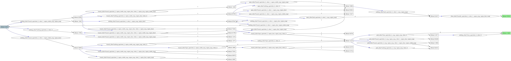

_**Note**: This repository contains explanation, code and demonstrations for my thesis at the [Autonomous Multi-Robots Lab](https://autonomousrobots.nl/) in the second year of my Master Robotics program at the Technical University of Delft. The aim of the thesis was to solve interaction uncertainty for decentralized multi-agent task and motion planning settings by extendinf the [TAMPURA](https://arxiv.org/pdf/2403.10454) framework. Two scenarios of this problem have been demonstrated below._

# TAMPURA for decentralized multi-agent settings

Decentralized multi-agent systems offer a powerful and scalable approach to solving complex, long-horizon tasks in dynamic and unstructured environments. By distributing responsibilities across multiple autonomous agents, these systems improve safety, efficiency, and modularity compared to single-agent or centralized approaches. Collaboration allows agents to share workloads, such as one agent holding an object while another opens a door, resulting in safer execution and reduced risk of failure. Decentralization also enables parallel task execution, significantly lowering overall execution time and resource consumption, which is especially valuable in high-stakes domains like warehouse automation, disaster response, and exploration.

However, decentralization introduces a key challenge: **interaction uncertainty**. Without a centralized planner to coordinate behavior, agents must reason independently under limited observability about others’ current actions, future plans, and action completion times. This uncertainty can lead to conflicts, inefficiencies, and coordination failures. This work addresses that gap by extending task and motion planning under uncertainty (TAMPURA) to decentralized settings. The proposed framework enables agents to model and adapt to each other's behavior during planning and execution without explicit communication, improving coordination in uncertain multi-agent environments.

## Toy examples


This project demonstrates the proposed decentralized task and motion planning framework using two representative two-agent scenarios, each with varying complexity and planning horizon lengths. While either robot can complete the full task independently, coordination significantly improves efficiency. Uncertainty is primarily addressed at the symbolic level, but the approach can be extended to handle geometric uncertainty using standard task and motion planning techniques. These settings illustrate the framework’s ability to handle interaction uncertainty in decentralized multi-agent systems.


### Cleaning Scenario

In this short-horizon collaborative task, two robotic manipulators work together to clean a surface beneath a block and then place the block back in its original position. The task is broken down into three sub-tasks: removing the block, cleaning the area, and replacing the block. The scenario highlights basic coordination between agents under partial observability. The baseline is shown below.

<p align="center">
  
</p>

### Mug Retrieval from Cabinet

A more complex, long-horizon task involves two mobile manipulators collaborating to retrieve a mug from a cabinet and ensuring the cabinet door is closed afterward. Sub-tasks include opening the cabinet door (via a button press), retrieving the mug, and closing the door. In this scenario, a decentralized TAMP module runs on one robot (the ego agent), which must reason about the uncertain behavior of the other agent. The ego agent cannot deterministically observe or predict the other agent's current or future actions, and must plan accordingly without assuming access to the other agent’s internal state or intentions. 

<p align="center">
  
</p>


## Method

This work extends the TAMPURA framework to decentralized multi-agent settings, where agents pursue shared goals under interaction uncertainty. Each agent independently plans its actions while reasoning about the uncertain, partially observable behavior of others. The ego agent observes the apparent action of the other agent, but due to perception noise and execution delays, it cannot be certain of the action’s success or true intent of the other agent. To address this, the framework models both the current and future behavior of the other agent using uncertain symbolic outcomes and learns an MDP to represent the behavior of the other agent. A key feature is the use of "other–ego action pairs" to delay observations and ensure realistic transitions, enabling the ego agent to plan robustly with partial knowledge. The approach improves coordination by leveraging domain-specific assumptions such as action locality and limited confusability between actions, resulting risk-aware, decentralized task and motion planning.

During MDP learning, the ego agent builds a model of the other agent's behavior by querying a behavior function. Depending on the scenario, the other agent may act randomly, be human-operated, or remain inactive. Random behavior leads to a larger, more branched MDP due to its unpredictability, while human or inactive agents produce more consistent and structured models, as illustrated below.


<p align="center">
  
</p>

<p align="center">
  
</p>

<p align="center">
  
</p>

## Install

Clone this repository
```
git clone git@github.com:akansha2001/tamp_multi_agent.git
```
In the root of the repository, install IsaacLab. 

### IsaacLab installation

Follow the instructions for installing IsaacLab from [website](https://isaac-sim.github.io/IsaacLab/main/source/setup/installation/index.html). Use the `pip` installation for IsaacSim and set up a `conda` environment.


Activate the IsaacLab environment. From the root of the repository, run the following commands

```
python -m pip install -e .
pip install pygraphviz
```

# Example Notebook

See `notebooks/grasping_env.ipynb` for a simple usage example.

# Notebooks

The notebooks are available for running in the `notebooks` folder of the repository. `grasping_env.ipynb` demonstrates a simple usage example. The folder includes the centralized deterministic planner baselines for the mug retrieval scenario and cleaning scenario.

# Retrieving a mug from a cabinet

The scripts for the mug retrieval scenario are available in the folder `multi_agent_mug`. Move this to `IsaacLab/source/isaaclab_tasks/isaaclab_tasks/manager_based/manipulation/lift/config/`. To generate the success rate for a manipulator picking an object from the cabinet and picking from a region outside the cabinet, run the script `pick_simulator.py` with command line argument `--simple` set to `1` for the latter and `2` for the former. Select a higher number of environments using the `--num_envs` argument for a better estimate of the true probability.

```
python IsaacLab/source/isaaclab_tasks/isaaclab_tasks/manager_based/manipulation/lift/config/multi_agent_mug/pick_simulator.py --num_envs 1000 --simple 1
```

This generates the script `pick_successes.py` with variables indicating the probability of success for the pick operation. Remove the file if it already exists. These variables are used to learn the probability of the ego agent's success during model learning.  Modify `TRAIN` and `EXEC` in the script for different model learning and execution settings in the script `multi_agent.py` and run using the following command.

```
python IsaacLab/source/isaaclab_tasks/isaaclab_tasks/manager_based/manipulation/lift/config/multi_agent_mug/multi_agent.py 
```

# Cleaning under an object

Move the `multi_agent_clean` folder to `IsaacLab/source/isaaclab_tasks/isaaclab_tasks/manager_based/manipulation/lift/config/`. Modify `TRAIN` and `EXEC` in the script for different model learning and execution settings. To visualize the results on IsaacLab, run the script `multi_agent_clean_sim.py` as shown below from the root of the repository. 


```
python IsaacLab/source/isaaclab_tasks/isaaclab_tasks/manager_based/manipulation/lift/config/tamp_uncertainty/multi_agent_clean_sim.py --num_envs 1
```

To obtain results without visualization, run the following command from the root of the repository.

```
python IsaacLab/source/isaaclab_tasks/isaaclab_tasks/manager_based/manipulation/lift/config/tamp_uncertainty/multi_agent_clean.py 
```

More information about single agent scenarios is available on [this repository](https://github.com/akansha2001/tamp_uncertainty.git).

# Results

Demonstrations are shown below for the other agent having the same algorithm as the ego agent, a random other agent, an apparently cooperative human agent and an inactive other agent.

<div align="center">
<table>
  <tr>
    <td align="center">
      <br>
      <strong>Nominal (Centralized Baseline)</strong>
    </td>
    <td align="center">
      <br>
      <strong>Random Agent</strong>
    </td>
  </tr>
  <tr>
    <td align="center">
      <br>
      <strong>Human Agent</strong>
    </td>
    <td align="center">
      <br>
      <strong>Inactive Agent</strong>
    </td>
  </tr>
</table>

<!-- The robot environments from the paper are in a separate [tampura_environments](https://github.com/aidan-curtis/tampura_environments) repo -->
